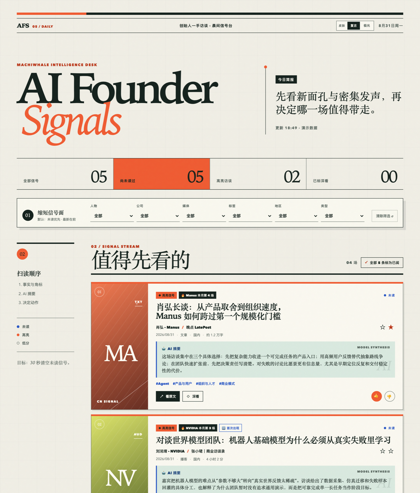

# AI Founder Signals

AI 创始人一手访谈探测器。每天自动扫 17 个信源 → 判定是不是创始人一手访谈 →
生成摘要卡片 → 你三十秒扫完，挑出想深看的。

**它只负责「发现」**：把值得一看的访谈摆到你面前。深读、提炼、归档是下一步，
交给你自己的 agent 和笔记系统（见下）。

## 两套皮肤

同一份内容，两种读法。右上角一键切换，选择记在浏览器本地。

### 复古 —— 报纸排版

衬线大标题、硬边分隔、油墨橙。信息密度高，像早报头版。



### 极光 —— 玻璃拟态

无衬线、荧光绿高亮、渐变封面、圆角卡片。松弛一些，适合长时间扫读。


> 截图用的是仓库自带的演示数据（`AFS_FEED_DATA_MODE` 不设为 `database` 时就是这个），
> 所以你 clone 下来第一眼看到的就是这个样子。

---

## 🤖 如果你是被丢进这个仓库的 AI 助手

按用途读，别通读：

| 任务 | 读这份 |
|---|---|
| **把它跑起来** | **[SETUP.md](SETUP.md)** — 5 步，每步带验证命令。不确定缺什么就跑 `./scripts/afs doctor`，它会逐项告诉你下一步 |
| **处理「深看」队列**（用户说「处理收藏队列」时） | **[docs/ARCHIVE-QUEUE.md](docs/ARCHIVE-QUEUE.md)** — 执行步骤、笔记质量标准，以及一条不能忽略的 provenance 规则 |
| **改任何东西之前** | **[PROJECT.md](PROJECT.md) §4「关键决策」** — 每条背后都有一次真实的翻车。有些看着「可以顺手优化」的地方是刻意为之 |

⚠️ **`docs/ARCHIVE-QUEUE.md` 是需要主动交给 agent 的那一份。** feed 只把条目放进队列，
消费队列的那一半仓库不提供——归档到哪儿取决于用户用什么记笔记。
那份文档写明了怎么接。

---

## 现状

每天 06:00 自动跑（launchd），`localhost:8166` 随时可看。
17 个信源全部可跑，178 测试全绿，成本约 **$1/月**（DeepSeek）+ Supabase 免费档。

详细进度、决策与已知问题在 **[PROJECT.md](PROJECT.md)——那份是权威来源**。

```bash
afs doctor   # 检查还缺什么（新环境先跑这个）
afs open     # 打开 feed
afs run      # 立刻抓一次，不等 06:00
afs queue    # 收藏队列 list / done
afs fetch    # 取某条完整正文，给深读用
afs logs     # 跟踪 worker 日志
```

## 一天里发生什么

```
06:00  worker  每个信源只取「上次检查之后」的新内容
         └─ 准入三层漏斗：信源先验 → 标题规则 → LLM 兜底
              ├─ 不通过 → 入库折叠，不抓正文、不花摘要钱
              └─ 通过   → 抓正文 → 摘要 → 分档 → 入库
随时   打开 feed 扫未读，点「◇ 深看」标记想深读的
稍后   afs queue list → 深读归档 → afs queue done
```

## 代码结构

```
src/pipeline/     准入判定（三层漏斗）、分档打分、人物公司归一化
src/adapters/     RSS / 播客 / YouTube / 配置化 JSON API / 通用 HTML
src/llm/          供应商抽象（DeepSeek 默认）、判定、摘要、引文守卫
src/worker/       SKIP LOCKED 队列、临时区生命周期、抓取与分析编排
src/feed/         视图模型、查询、筛选与交互状态
src/db/           Drizzle 五表 schema
prompts/          L2 判定 + 摘要 prompt
supabase/         可重放 migration（含默认拒绝一切的 RLS）
deploy/           launchd 模板，`afs install` 按实际路径生成
```

## 开发

```bash
npm ci
npm test          # Vitest，当前 178 项
npm run typecheck # tsc --noEmit
npm run lint
npm run build
```

配置见 `.env.example`。数据库迁移以 `supabase/migrations/` 为事实来源，
Drizzle schema 用于应用侧类型与查询。

> 本项目只监听 `127.0.0.1`，没有登录态——**不要暴露到公网**。
> 数据库那层已开 RLS 拒绝一切（PostgREST 读不到），但 Web 服务本身没有认证。

---

## 反馈

- **用不起来 / 报错** → 先跑 `./scripts/afs doctor`，它会逐项告诉你缺什么；
  仍然卡住就开 [Issue](https://github.com/isalicema/ai-founder-signals/issues)，
  **把 doctor 的输出贴上**（它不含任何密钥）
- **想加信源 / 改判定规则** → 直接 fork 改，`src/db/seed/sources.ts` 和
  `prompts/` 就是给你改的
- **其它** → yangwutu@gmail.com

优先用 Issue 而不是邮件：答案留在公开的地方，下一个遇到同样问题的人能搜到。

---

## License

[MIT](LICENSE)

Made with 妙蛙种子, 星子, RabbitT by Machiwhale Studio
